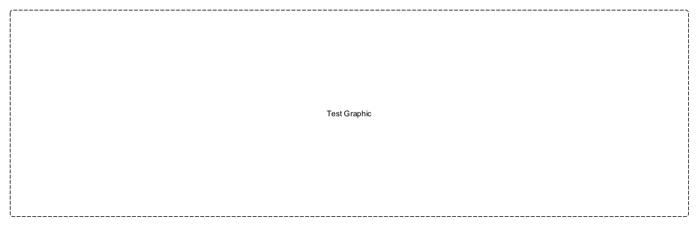

## Scenario 
Design and deploy a complete solution of a highly available, highly resilient flask application using Azure, kubernetes and IaC.

## Design


## Required end state
- Three environments:
    - Dev: sub1
    - Stg: sub1
    - Prd: sub2
    - Dr:  sub2
- Azure resources
    - AAD users
    - service principals
    - aks
    - vnet
    - key vault
    - Container registry
    - Storage
    - Database
    - App gateway
    - Public IP
    - DNS
- rbac roles
    - Full admin
    - Contributor
    - Reader 
- Github resources
    - Repo
    - GitAction or AZDO pipelines
- Deployed services
    - Wordpress site
    - Grafana dashboard
    - Prometheus
- Features
    - container logging to Azure
    - App Insights
    - Monitoring Dashboard in Azure
    - Monitoring Dashboard in Grafana
    - Blue / Green deployment via istio
    - Canary deployments via helm
    - well tagged resources

## Tools
- Azure subscriptions
    - non-prod
    - prod
- [Linux on Windows(WSL)](https://docs.microsoft.com/en-us/windows/wsl/install)
- [WIndows Terminal](https://www.microsoft.com/en-us/p/windows-terminal/9n0dx20hk701?rtc=1&activetab=pivot:overviewtab)
- [Terraform (1.1.2)](https://www.terraform.io/downloads)
- [Terragrunt](https://github.com/gruntwork-io/terragrunt/releases)
- [Homebrew on linux](https://docs.brew.sh/Homebrew-on-Linux)
- [IDE (pycharm)](https://www.jetbrains.com/pycharm/)
- [graph (yed)](https://www.yworks.com/downloads#yEd)
- [Azure Palette](https://docs.microsoft.com/en-us/azure/architecture/icons/)
- [Github repo](https://github.com/linuxlsr/story-azure-solution-1)
- [Azdo project (if needed)](https://dev.azure.com/linuxlsr/Story%20AKS%20IaC)

## Notes
- [Setup](setup/index.md)
- [Modules](modules/index.html)